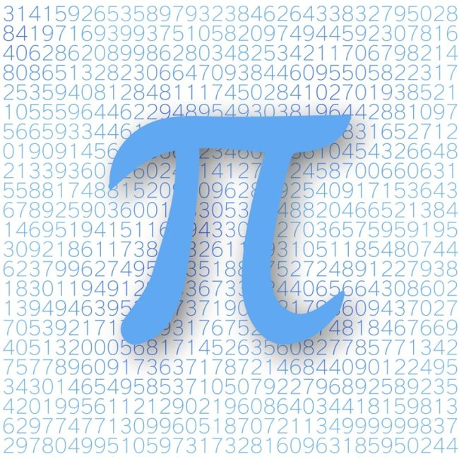
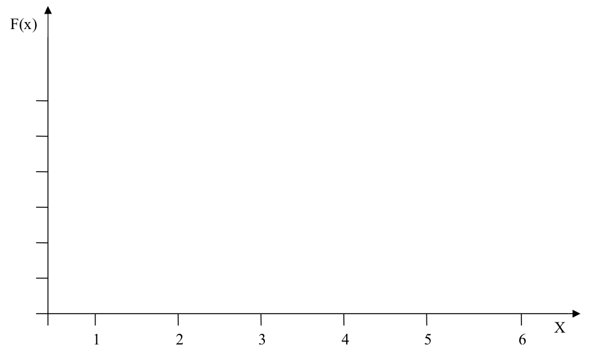
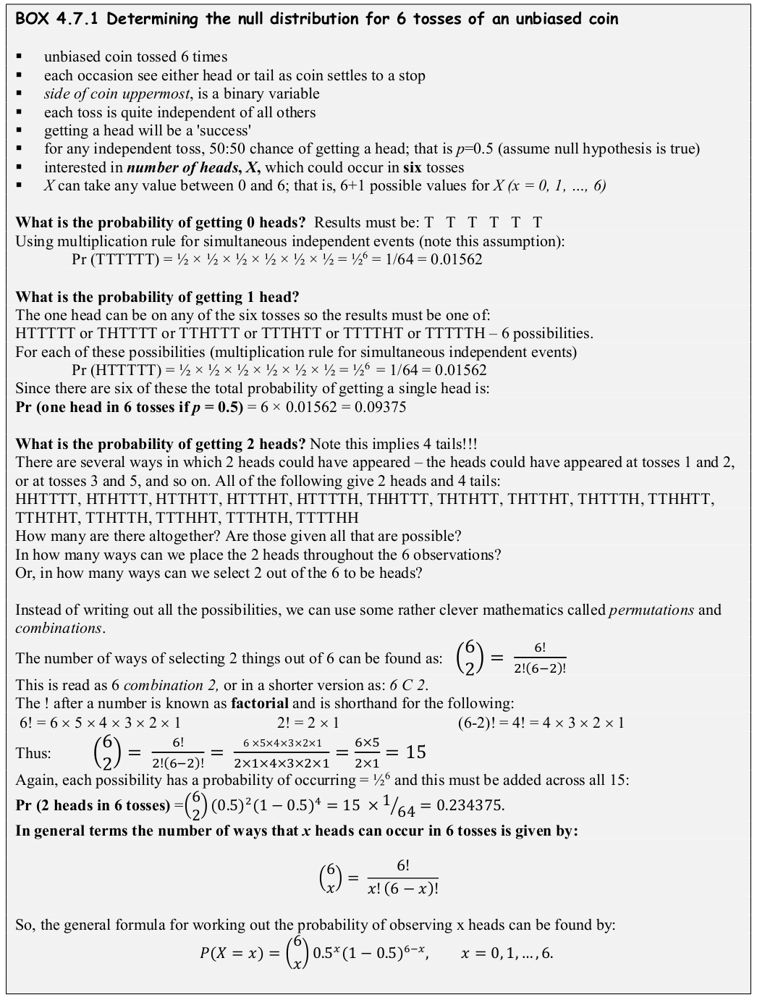
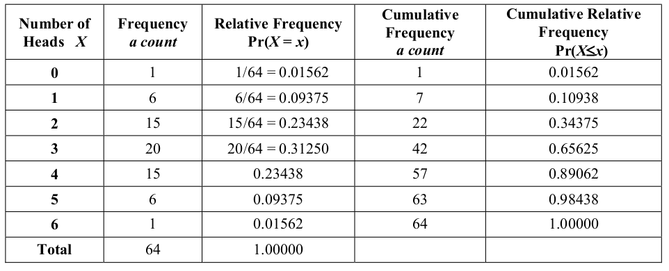
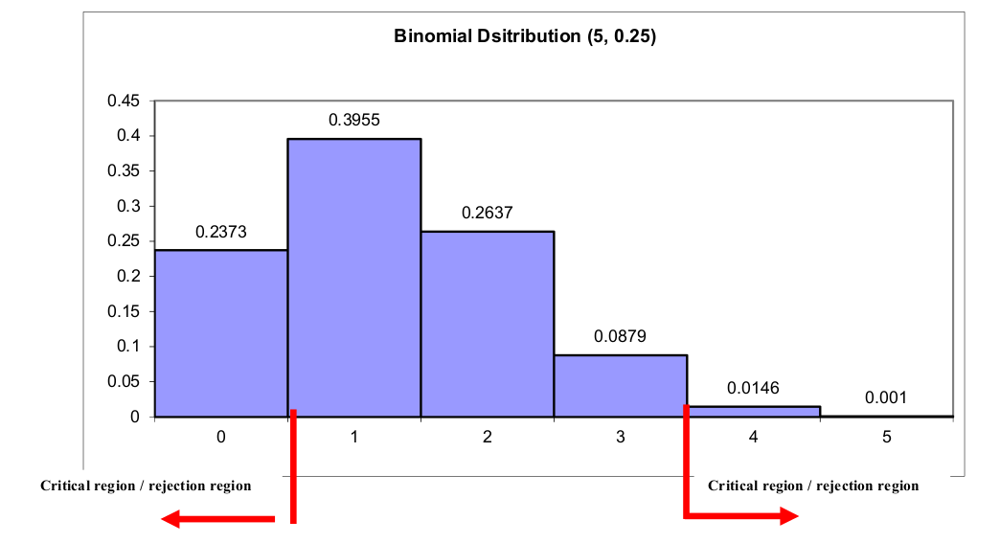
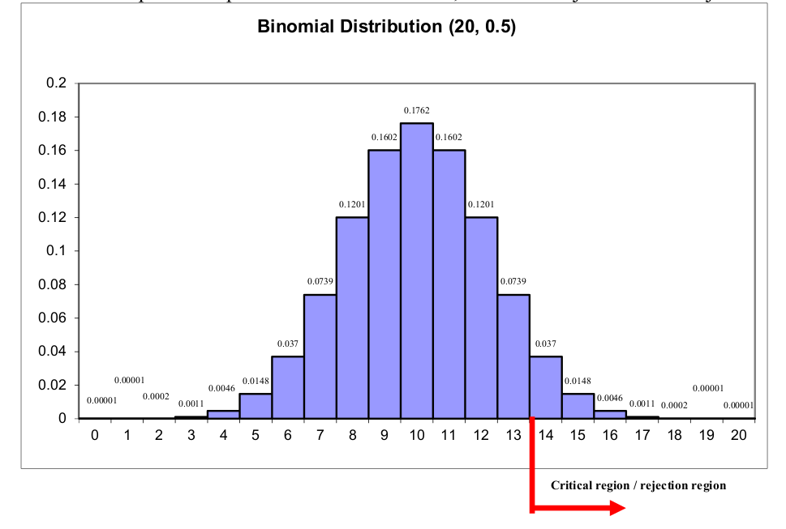
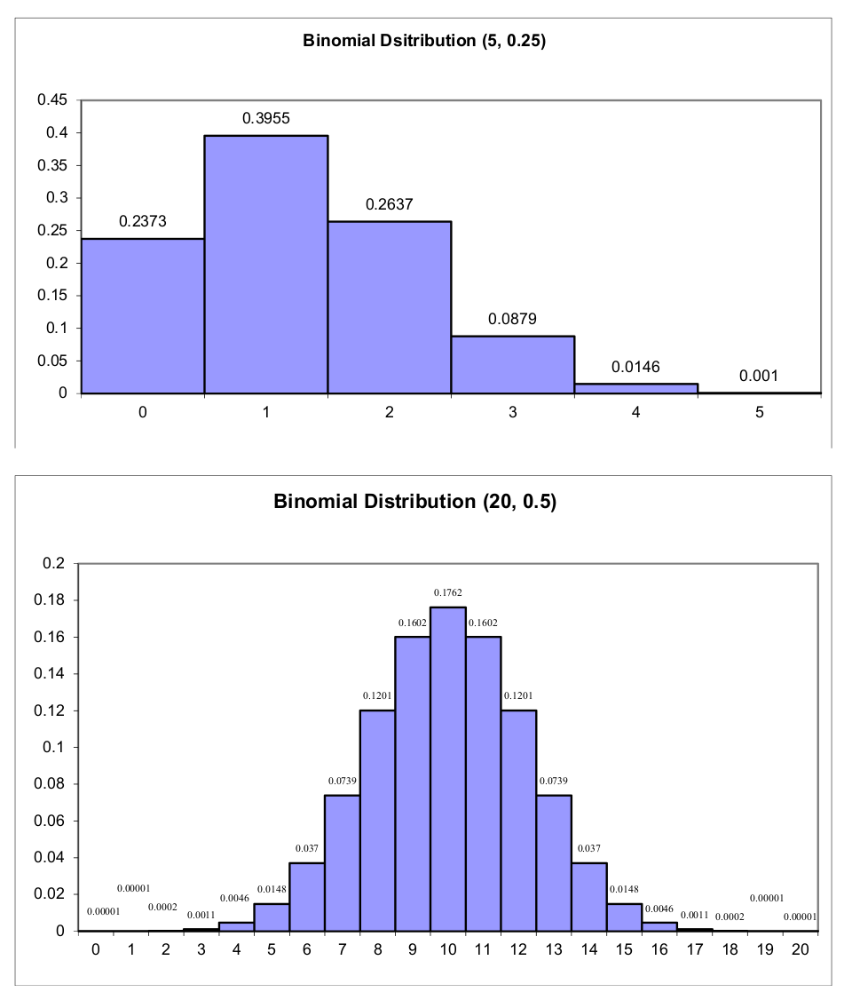

<!-- Make output window wider for R output so it doesn't split at columns at end -->
```{r set-options, echo=FALSE, cache=FALSE}
options(width = 100)
library(learnr)
```

<p style="text-align: center;"><font size="+2">James McBroom - July 2021 </font></p>
<center><a href="mailto:j.mcbroom@griffith.edu.au"></a></center>

<br><br>

> # Outline:
>
> 1. ***Revision and Basics for Statistical Inference***
>
>  - Review – Revision and things for you to look up
>
>  - Types of Inference
>
>  - Notation
>
>  - Probability Distribution Functions
>
>   - Areas Under a Probability Distribution Curve - Probabilities
>
>   - Tchebychef’s Rule – applies for any shaped distribution
>
>   - Probability of a Range of the Variable
>
>   - Cumulative Probability
> 
>   - Central Limit Theorem 
>
> 2. ***Inference for Counts and Proportions – test of a proportion***
>
>   - An Example
>
>   - One- and Two-Tailed Hypotheses
>
>   - The p-value of a Test Statistic
> 
>
> 3. ***Statistical Distributions***
>
>   - The Binomial Distribution – for counts and proportions
>
>       - Examples using the Binomial Distribution
>
>
>   - The Normal Distribution
>
>   - The Normal Approximation to the Binomial
> 
>
> 4. ***Using R***
>
>  - Calculating Binomial and Normal probabilities using R.
>
>  - Sorting data sets and running functions separately for different categories
>
>
> **Workshop for Week 4**
>
> - Based on week 2 and week 3 lecture notes.
>
> **R:**
>
> - Entering data, summarising data, rep(), factor()
> - using R for Goodness of Fit and test of independence.
>
> 
> **Project Requirements for Week 3**
>
> - Ensure you continue to collect your individual project data;
>
>
> **Project Requirements for Week 4**
>
> Bring your individual data to your workshop, where it will be combined
> with your group member's data to create a large data set you can then
> use to do your project assessment on for the rest of trimester.
>
>
> **Things YOU must do in Week 3/4**
>
> - Revise and summarise the lecture notes for week 2;
>
> - Read your week 3 & 4 lecture notes before the lecture;
> - Read the workshop on learning@griffith before your workshop;
> - Revise and practice the $\chi^2$ tests.

# 1. Revision and Basics for Statistical Inference

## 1.1 Revision and things for you to look up

Sample versus population & statistic versus parameter – see diagram in week 1 notes.
Sampling variability

## 1.2 Types of Inference
2 basic branches of statistical inference: estimation and hypothesis testing.

**eg1:** Groundwater monitoring:

- what is the level of sodium (na) in the groundwater downstream of the landfill (gdf)?
- is the level of na in the gdf above the set standard for drinking water?
- what level of na in the gdf can be expected over the next 12 months?

**eg2:** A new treatment is proposed for protecting pine trees against a disease – does it work? How effective is it? Does it give more than 20% protection?

## 1.3 Notation

***population parameter:*** Greek Letter

***sample statistic:*** **Name** - Upper case; **observed value** - lower case

***sample statistic:*** is an **ESTIMATOR** of **population parameter** - use of ‘hat’ over the Greek symbols: $\hat{\theta}$, $\hat{\sigma}$, $\hat{\phi}$.

Some estimators as used so often they get a special symbol. E.g.: Sample mean, $\overline{X} = \hat{\mu}$, the estimate of the population mean $\mu$.

Sometimes use letters eg SE for standard error – the standard deviation of a sample statistic

## 1.4 Probability Distribution Functions: $f(x)$

Statistical probability models:

Can be expressed in **graphical form – distribution curve**

- possible values of X along x-axis
- relative frequencies (or probabilities) for each possible value along y-axis
- total area under curve is 1; representing total of probabilities for all possible values/outcomes.

Shape can also be described by appropriate mathematical formula and/or expressed as a table of possible values and associated probabilities.

If the allowable values of X are discrete: Probability Mass Function (PMF), $f(x) = Pr(X = x)$.

If the allowable values of X are continuous: Probability Density Function (PDF) **NB** $f(x) \neq Pr(X = x)$ for continuous r.v.s.

## 1.5 Areas Under a Probability Distribution Curve - Probabilities

For continuous variables, the total area under the probability curve will be 1, as this is the
totality of the possible values X can take. Similarly, the sum over all allowable values of a
discrete random variable will be 1.

## 1.6 Tchebychef’s Rule – applies for any shaped distribution

For any integer $k > 1$, at least $100(1 − \frac{1}{k^2})\%$  of the measurements in a population will
be within a distance of $k$ standard deviations from the population mean:

$$
Pr(\mu - k \sigma \leq X \leq \mu + k \sigma) \geq 1 - \frac{1}{k^2}
$$

\begin{align*}
\text{If } k = 2, & \text{   } Pr(\mu - 2\sigma \leq X \leq \mu + 2\sigma) \geq 1 - \frac{1}{2^2} = 0.75 & \text{   } \text{75% within 2 sd of population mean} \\
\text{If } k = 3, & \text{   } Pr(\mu - 3\sigma \leq X \leq \mu + 3\sigma) \geq 1 - \frac{1}{3^2} = 0.89 & \text{   } \text{89% within 3 sd of population mean} \\
\text{If } k = 4, & \text{   } Pr(\mu - 4\sigma \leq X \leq \mu + 4\sigma) \geq 1 - \frac{1}{4^2} = 0.94 & \text{   } \text{94% within 4 sd of population mean} 
\end{align*}

E.g. Tolerance intervals for ground water monitoring.

## 1.7 Probability of a Range of the Variable

For continuous random variables, the area under the curve representing f$(x)$ between two
points is the probability that $X$ lies between those two points: 

$$Pr(a < X < b) = \int_b^a f(x) dx.$$

Note that $P(X = a) = 0$ for all $a \in X$ when $X$ is continuous. (Why??)

For discrete random variables, $P(X = a) = f(a)$, and to find the probability that $X$ lies in
some range of values (e.g. $P(a \leq X < b)$, $P(X > c)$, $P(X < d)$ etc.), we simply sum the
probabilities associated with the values specified in the range: 

$$
P(X \in A) = \Sigma_{x \in A} f(x).
$$

**Example: Throwing a Fair Dice**

The probability that any of one of the six sides of a fair dice lands uppermost when thrown is
1/6. This can be represented be represented mathematically as:

$$
P(X = x) = \frac{1}{6}, \hspace{0.3 cm} x = 1, 2, \ldots, 6.
$$

where $X$ represents the random variable describing the side that lands uppermost, and $x$
represents the possible values $X$ can take. This kind of distribution is known as a Uniform
distribution (why?). 

How would we represent this probability mass function (pmf) graphically?

<br><br><br><br><br><br><br><br><br><br><br><br><br><br><br><br>


## 1.8 Cumulative Probability (CDF): $F(x) = Pr(X \leq x)$

The cumulative density function (CDF) of a random variable is the probability that the
random variable takes a value less than or equal to a specified value, x:

$$
F(x) = Pr(X \leq x)
$$

For the dice example, the cumulative probability distribution can be calculated as follows:

| $X$    | 1             | 2                                         | 3             | 4             | 5             | 6             |
|--------|---------------|-------------------------------------------|---------------|---------------|---------------|---------------|
| $f(x)$ | $\frac{1}{6}$ | $\frac{1}{6}$                             | $\frac{1}{6}$ | $\frac{1}{6}$ | $\frac{1}{6}$ | $\frac{1}{6}$ |
| $F(x)$ | $\frac{1}{6}$ | $\frac{2}{6}$ | $\frac{3}{6}$ | $\frac{4}{6}$ | $\frac{5}{6}$ | $\frac{6}{6}$ |

We can also express the CDF for this example mathematically (note that this is not always
possible for all random variables, but it is generally possible to create a table as above):

$$
F(x) = Pr(X \leq x) = \frac{x}{6}, \hspace{0.3 cm} x = 1, 2, \ldots, 6.
$$

(Check for yourself that the values you get from this formula match those in the table.)

The cumulative probability is found by summing the relevant probabilities, starting from the
left hand (smallest) values of the variable and stopping at the specified value; this gives the
cumulative probability up to the stopping point and represents the probability that the variable
is *less than or equal to* the specified value.

<center>

</center><br>

What is $Pr(X < 4)$?

## 1.9 Central Limit Theorem

In probability theory, the central limit theorem (CLT) states conditions under which the mean
of a sufficiently large number of independent random variables, each with finite mean and
variance, will be approximately normally distributed. If we were to take lots of samples from
our population of interest, the means of these samples would be normally distributed.

The central limit theorem also requires the random variables to be identically distributed,
unless certain conditions are met. The CLT also justifies the approximation of large-sample
statistics to the normal distribution in controlled experiments.

# 2. Inference for Counts and Proportions – Test of a Proportion

## 2.1 An Example

Suppose we are concerned that the coin used to decide who will bat first in a cricket match is
not unbiased. Note that this scenario is analogous to situations which arise in all sorts of
research situations. For example, consider the following claims: the sex ratio for some animal
species is 50:50; half of the Australian population have access to the internet at home; fifty
percent of Australian children now go on to tertiary studies; there is a 50% chance that in the
next six months there will be a better than average rainfall in Queensland; half of the
eucalyptus species in Northern New South Wales are suffering from the disease die back.

**Research Question:**

> Is the coin unbiased? That is, if it is tossed, is it just as likely to come down with a head
> showing as with a tail? Is the probability of seeing a head when the coin is tossed equal to
> ½?

**What sort of experiment:**

> A single toss will not tell us much – how many tosses will we carry out? Resources are
> limited so we decide to use only six.

**What sort of data:**

> Success or failure – assume a head is a success.
>
> ***Binary Data*** – each toss is a Bernoulli trial (an experiment with only two possible
> outcomes).

**What feature from the experiment will have meaning for the question:**

> The number of heads seen in the sample. If the coin is unbiased we would expect to see
> three heads and three tails in 6 tosses.
> number of heads is a Binomial Variable – the sum of a series of independent Bernoulli
> trials.

**Hypotheses:**

> We want to test the current belief that the probability of seeing a head is 0.5. The null
> hypothesis always reflects the status quo and assumes the current belief to be true. The
> alternative hypothesis is the opposite of the null and reflects the reason why the research
> was conducted.

> **Null Hypothesis:**
>
> $H_0$: within the population of interest, the probability that a head will be seen is $\frac{1}{2}$.
>
> $H_0: Pr(\text{head}) = 0.5$.
>
> **Alternative Hypothesis:**
>
> $H_1$: the distribution within the population is not as specified; the probability that a head
> will be seen is not one half.
>
> $H_1: Pr(\text{head}) \neq 0.5$.

**Sample:**

> Selected at random from the population of interest – six random throws.

**Test Statistic:**

> Seems sensible to look at the number of heads in the sample of 6 tosses as the
> test statistic - how likely are we to get the number of heads seen?

**Null Distribution:**

> The distribution of the random variable, number of heads in a sample of six, IF the null
> hypothesis is true – that is, if $Pr(\text{head}) = 0.5$. See below for derivation and final distribution.
>
<center>

</center><br>

> The following table shows the probability distribution function for the number of heads in 6 tosses of unbiased coin (a
> binomial variable with $n=6$ and $p=0.5$, as derived in the box above). Note that R can be used to get these values.
>
<center>

</center><br>

> NOTE THAT THIS TABLE RELIES ON THE FACT THAT EACH OF THE 64 POSSIBLE OUTCOMES IS EQUALLY
> LIKELY – WHAT HAPPENS IF THE PROBABILITY OF A HEAD IS TWICE THE PROBABILITY OF A TAIL??
>
> - What is the probability of getting 5 or 6 heads?
> - What is the probability of getting at least 4 heads?
> - What is the probability of getting no more than 3 heads?

**Significance Level, $\alpha$:**

> Traditionally assume 0.05 (5%).

**Critical Value, A:**

> AND NOW A PROBLEM ARISES!!!!!!!

## 2.2 One- and Two-Tailed Hypotheses

We need a value (or values) of the test statistic that will ‘cut off’ a portion of the null
distribution representing 95% of the entire area.

Firstly we need to decide where the 5% to be omitted is to be. Will it be in the **upper tail** as it
was for the chi-squared situation? Or, will it be in the **lower tail**? Or, will it need to be
apportioned **across both tails**?

The answer will depend on the **alternative hypothesis**. Consider the following three
possibilities:

1. the researcher’s belief is such that the test statistic will be **larger** than that expected if the
null hypothesis is true;

2. the researcher’s belief is such that the test statistic will be **smaller** than that expected if the
null hypothesis is true;

3. the researcher’s belief is such that the it is not clear whether the test statistic will be larger
or smaller, it will just be **different** from that expected if the null hypothesis is true.

***Two-Tailed Hypothesis***

In the example, the question simply raises the issue that the coin may not be unbiased. There
is no indication as to whether the possible bias will make a head more likely or less likely.
The results could be too few heads or too many heads. This is a case 3 situation and is an
example of a **two-tailed hypothesis**.

The critical value can be at either end of the distribution and the value of the stipulated
significance, 0.05, must be split between the two ends, 0.025 (or as close as we can get it)
going to each tail.

***One-Tailed Hypothesis***

Suppose instead that the researcher suspects the coin is biased in such a way as to give more
heads and this is what is to be assessed (tested). The alternative hypothesis would be that the
probability of a head is greater than $\frac{1}{2}$: $H_1: p > 0.5$ – a case 1 situation.

Clearly the opposite situation could also occur if the researcher expected bias towards tails
leading to an alternative: $H_1: p < 0.5$. This is a case 2 situation.

In both of these cases, the researcher clearly expects that if the null hypothesis is not true it
will be false in a *specific way*. These are examples of a **one-tailed hypothesis**.

The critical value occurs entirely in the tail containing the *extremes* anticipated by the
researcher. Thus for case 1 the critical value will cut off an *upper tail*. For case 2 the
critical value must cut off a *lower tail*.

**Back to the Example**

The example as given is a two-tailed situation thus two critical values are needed, one to cut
off the **upper 0.025** portion of the null distribution, and the other to cut off the **lower 0.025**
portion.

To find the actual critical values we look at the distribution as we did for chi-squared.

**AND NOW ANOTHER PROBLEM ARISES!!!!!!!**

For chi-squared we had a continuous curve and the possible values could be anything,
enabling us to find a specific value for any significance level nominated. Here we have
discrete data (a count) with only the integer values from zero to six and their associated
probabilities. Working with 5% we want the values that will cut off a lower and an upper
probability of 0.025 each.

From the table we see:

- probability of being less than 0 = 0
- probability of being less than 1 = 0.01562
- probability of being less than 2 = 0.10938

The closest we can get to 0.025 in the lower tail is 0.01562 for a number of heads of less than 1 (i.e. 0).
Similar reasoning gives an upper critical value of greater than 5 (i.e. 6) with a probability of
0.01562.

We cannot find critical values for an exact significance level of 0.05 in this case.
The best we can do is to use a significance level of $0.01562 + 0.01562 = 0.03124$ and the
critical values of 1 and 5 – approximately 97% of the values lie between 1 and 5, inclusive.

***?? What significance level would you be using if you selected the critical values of (less
than) 2 and (greater than) 4 ??***

**Critical Region:**

> The part of the distribution more extreme than the critical values, A.
> The critical region for a significance level of 0.03124 will be any value less than 1 or any
> value greater than 5: 
>
> $T < 1$ or $T > 5$.
>
> Thus, if the sample test statistic (number of heads) is either zero or six, then it lies in the
> *critical region* (reject the null hypothesis). Any other value is said to lie in the *acceptance region* (cannot reject the null hypothesis).

**Test Statistic:**

> Calculated
> using the sample data – number of heads.

***We now need to carry out the experiment***

**Collect the data:**

> Complete six independent tosses of the coin.
> The experimental results are:
> H T H H H H


**Calculate the test statistic:**

> Test statistic (number of heads) = 5

**Compare the test statistic with the null distribution:**

> Where in the distribution does the value of 5 lie?
>
> Two possible outcomes:
>
> 1. T lies in the critical region - conclusion: **reject $H_0$** in favour of the alternative hypothesis.
>
> 2. T does not lie in critical region – conclusion: **do not reject $H_0$** (there is insufficient evidence to reject $H_0$).
>
> Here we have a critical region defined as values of $T < 1$ and values of $T > 5$. The test statistic
> of 5 does NOT lie in the critical region so the null hypothesis $H_0$ is not rejected.

**Interpretation – one of two possibilities**

> **Rejecting $H_0$ in favour of $H_1$** – within the possible error defined by the significance level, we
> believe the alternative hypothesis to be true and the null hypothesis has been falsified.
>
> **Failing to reject $H_0$** – there is no evidence to reject the null hypothesis.
> **Note: this does not prove the null hypothesis is true!** It may simply mean that the data
> are inadequate – e.g. the sample size may be too small (Mythbusters effect...).
>
> For the example, the null has not been rejected and we could give the conclusion as:
> 
> *We cannot reject the null hypothesis. We conclude that, based on this data, there is insufficient evidence to suggest the coin is biased.*
>
> Note that this does not PROVE that the coin is unbiased, it simply says that given the available data there is no
> reason to believe that it is biased.
>
>NOTE: Intuitively, getting 5 out of 6 is not particularly informative – a sample of 6 is very
> small. If the equivalent figure of 15 out of 18 were obtained what would the decision be?


## 2.3 The $p$ - value of a test statistic.

An alternative to working with a specific significance level is to use what is known as the $p$ -
value of the test statistic. This is the probability of getting a value ***as or more extreme than
the sample test statistic***, assuming the null hypothesis is true. Instead of giving the conclusion
conditioned on the possible error as determined by the significance level, the conclusion is
given together with the actual $p$-value. There are various ways of expressing this and some
possible wordings are given with each example below.

In the example above, we had a sample test statistic of 5 heads. What is the probability of observing
a value this extreme, or more extreme, if the probability of a head is $0.5$ (i.e. if the null
hypothesis is true)? From the table we want the probability of 5 or 6 heads.

If the coin is unbiased, the probability of getting 5 heads in 6 independent random tosses is
$0.09375$. The probability of getting 6 heads is $0.01562$. Therefore, the probability of selecting
a number as or more extreme than 5 is: $0.09375 + 0.01562 = 0.10937$. Note that this can be
read directly from the cumulative column of the table by realising that:

$$ Pr(X \geq 5) = 1 – Pr(X < 5) = 1 – Pr(X \leq 4) = 1 - 0.89062 = 0.10937$$

There is approximately an 11% chance of seeing something as or more extreme than the observed sample
data just by pure chance, assuming the probability of a head is 0.5 – this seems like
reasonable odds.

# 3. THEORETICAL STATISTICAL DISTRIBUTIONS

All forms of statistical inference draw on the concept of some form of theoretical or empirical
statistical model that describes the values that are being measured. This model is used to
describe the distribution of the chosen test statistic under the null hypothesis (that is, if the
null is true).

## 3.1 The Binomial Distribution – Discrete Variable

The data and test statistic used for the coin example were a specific case of the binomial
probability distribution.

**binary variable** - variable can have only two possible values: present-absent, yes-no, success-
failure, etc.

**Bernoulli trial** - process of deciding whether or not each individual has the property of
interest; is a success or a failure.

***The sum of $n$ independent Bernoulli trials results in a variable with a binomial distribution (a
binomial random variable).***

**A Binomial random variable** measures the number of successes, number of presences, number
of yes's etc. out of the total number of (independent) trials ($n$) conducted.

> ***The Binomial Setting***
>
> 1. There are a fixed number of observations (trials), $n$.
>
> 2. The $n$ observations (trials) are all independent.
>
> 3. Each observation falls into one of just two categories, which for convenience we call
“success” and “failure” (but could be any dichotomy).
> 
> 4. The probability of a “success” is called $p$ and it is the same for each observation. (Note that this implies the probability of a "failure" is $(1-p)$, since there are only two (mutually exclusive and exhaustive) categories for each trial outcome.)

Mathematical Jargon: $X \sim \text{Bin}(n, p)$

> $X$ is distributed as a Binomial random variable with number of trials $n$ and probability of "success" $p$.

The mathematical model for the probability mass function of a binomial random variable is
given by:

$$
Pr(X = x; n, p) = {n\choose x} p^x (1-p)^{(n-x)}, \text{  } x = 0, 1, 2, \ldots, n, \text{  } 0 \leq p \leq 1,
$$

where:

- $X$ is the name of the binomial variable – the number of successes
- $n$ is the sample size – the number of identical, independent observations;
- $x$ is the number of successes in the $n$ observations;
- $p$ is the probability of a success.

The mathematical model in words is:

> the probability of observing $x$ successes of the variable, $X$, in a sample of $n$
independent trials, if the probability of a success for any single trial is the same and
equal to $p$.

(Compare this formula to that discussed in the coin toss example box.)

**Binomial Tables:** Binomial probabilities for various (but very limited) values of $n$ and $p$ can be found in table form. See the Tables folder on the L@G site. Also note the folder contains a binomial table generator written in java script that will show you probabilities for user-selected $n$ and $p$. R will also calculate Binomial probabilities (see R section in these notes).

### 3.1.1 Examples Using the Binomial Distribution

#### Example 1:
Each child born to a particular set of parents has probability $0.25$ of having blood type O. If
these parents have 5 children, what is the probability that exactly 2 of them have type O
blood?

Let $X$ denote the number of children with blood type O. Then $X \sim \text{Bin}(5, 0.25)$. We want to find
$P(X = 2)$. Using the Binomial pmf above:

\begin{align*}
P(X = 2) &= {5 \choose 2} \times 0.25^2 \times (1-0.25)^{(5 -2)} \\
         &= 10 \times 0.25^2 \times 0.75^3 \\
         &= 0.2637.
\end{align*}

The probability that this couple will have 2 children out 5 with blood type O is 0.2637. Can you find this probability in the Binomial tables?


#### Example 2:
A couple have 5 children, and two of them have blood type O. Using this data, test the
hypothesis that the probability of the couple having a child with type O blood is 0.25.

We are testing the following hypotheses:

\begin{align*}
H_0: &\text{the probability of the couple having a child with type O blood is 0.25} \\
H_0: &P(\text{Blood Type O}) = 0.25
\end{align*}

versus

\begin{align*}
H_1: &\text{the probability of the couple having a child with type O blood is not 0.25} \\
H_1: &P(\text{Blood Type O}) \neq 0.25
\end{align*}

This is very similar to the coin tossing example above. Our test statistic will be the number of
children with type O blood, which we are told in the question is T = 2.

The null distribution is the distribution of the test statistic assuming the null hypothesis is true.
$T$ is binomial with $n=5$ and $p=0.25$. This distribution is shown here graphically:

<center>

</center><br>

Significance level $\alpha = 0.05$ (two-tailed = 0.025 either end). However, because this is a discrete
distribution we may not be able to get exactly 0.05.

In the right hand tail using 3 as the critical value gives $0.0146 + 0.001 = 0.0153$ (using 2 as
the critical value would make the overall $\alpha$ too large). In the left hand tail the first category is
very large but it’s the best we can do, so  $\leq 0$ gives 0.2373.

This means that the overall significance level for this test is $\alpha = 0.0153 + 0.2373 = 0.2526$ (the small sample size, $n = 5$, is a big problem in this case).

Our test statistic $T = 2$. This does not lie in the critical region.

**Inference:** There is insufficient evidence to reject the null hypothesis that the
probability of the couple having a child with type O blood is 0.25, at the $\alpha = 0.2526$ level of
significance.

#### Example 3. 
You have to answer 20 True/False questions. You have done some study so your answers
will not be total guesses (i.e. the chance of getting any one question correct will not be 50/50).
If the probability of getting a question correct is 0.60, what is the probability that you get exactly 16
of the 20 questions correct?

Let $X$ denote the number of questions answsered correctly. Then $X \sim \text{Bin}(20, 0.6)$. We want to find
$P(X = 16)$. Using the Binomial pmf:

\begin{align*}
P(X = 2) &= {20 \choose 16} \times 0.6^{16} \times (1-0.6)^{(20 - 16)} \\
         &= 4845 \times 0.6^{16} \times 0.4^4 \\
         &= 0.0349.
\end{align*}

The probability of getting 16/20 True/False questions correct (if the probability of a correct
answer is 0.60, and assuming your answers to each question are independent) is 0.0349. You
need to study harder!

This is the probability of getting exactly 16 correct. What is the probability of getting 16 or
less correct? We could sum the probabilities for getting 0, 1, 2, 3....16 correct (tedious!!) or
we could note that $P(X \leq 16) = 1 − P(X > 16)$:

\begin{align*}
P(X \leq 16) &= 1 - \sum_{x = 17}^{20} P(X = x) \\
 &= 1 - \left( P(X = 17) + P(X = 18) + P(X = 19) + P(X = 20) \right) \\ 
 &= 1 - (0.012 + 0.003 + 0.0005 + 0.00004) \\
 &= 0.984
\end{align*}

(Make sure you know where these numbers come from).

There is a 98.4% chance that you will answer between 0 and 16 questions correctly. More to the
point, there is only a less than 2% chance of answering 17 or more questions correctly
with the level of study undertaken (that is, a level of study that leads to a 60% chance of
answering any one question correctly).

#### Example 4.
You decide to do an experiment to test whether studying for 5 hours increases your chance
of getting a correct answer in a T/F exam compared to simply guessing (no study). You study
for 5 hours, answer 20 T/F questions, and discover you answered 16 correctly. Test your
hypothesis using this sample data.

Note: this is a one-tailed (upper) hypothesis test, since your research question asks whether 5 hours of study
will *increase* the chance of successfully answering a question, $p$, over and above guessing (ie will $p$ be *greater* than 0.5?).


\begin{align*}
H_0: & p \leq 0.5 \\
H_1: & p > 0.5
\end{align*}

With our sample of 20 questions and 16 successes, do we hvae enough evidence to reject $H_0$?

**Null Distribution:** the distribution of the test statistic assuming the null hypothesis is true.
This is a $\text{Bin}(20, 0.5)$ and is shown graphically below.

<center>

</center><br>


Significance level $\alpha = 0.05$ (one tailed, all in the upper tail). Test statistic $T = 16$.

To obtain the critical value we need to find the value in the upper tail that has 0.05 of values
(or as close as we can get to it) above it. We can sum the probabilities backwards from 20
until we reach approximately 0.05: 

$$0.000001 + 0.00001 + 0.0002 + 0.0011 + 0.0046 + 0.0148
+ 0.037 = 0.0577$$

So our critical value is 13, and the critical region is any value greater than
13.

The test statistic $T = 16 > 13$. Therefore we reject $H_0$ and conclude that the probability of
getting a T/F question correct is significantly greater than $0.50$ if we study for 5 hours, at the
$\alpha = 0.05722$ level of significance.

**NOTE:**

> If we took the critical value to be 14, our significance level would be 0.02072 and our test
statistic would still be significant (i.e. we would still reject the null hypothesis).
>
> New conclusion: The test statistic of T = $16 > 14$. Therefore we reject $H_0$ and conclude that the
probability of getting a T/F question correct is significantly greater than 0.50 if we study for 5
hours, at the $\alpha = 0.02072$ level of significance.
>
> What is the main effect of reducing the significance level? We have reduced the chance of a
Type I error. Make sure you can explain this. Can the significance level be reduced further?


In example 3 we found that the probability of getting 16/20 True/False questions correct (if the probability of a correct
answer is 0.60) is 0.0349. You should perhaps study more.

If the probability of getting a correct answer really is 0.6, how many of the 20 questions
would you expect to answer correctly? 

> $$0.6 \times 20 = 12$$.

What should the probability of correctly answering a question be to make 16 correct answers
out of 20 the expected outcome?

> \begin{align*}
 p \times 20 &= 16\\
 p &= \frac{16}{20} \\
 &= 0.8
 \end{align*}

***Back To The Theoretical Binomial Distribution:***

The expected (mean) value of the random variable $X \sim \text{Bin}(n, p)$ is $np$. Note that this value does not always work out to be a whole number. You should think of the expected value (or mean) as the long run, average value of the random variable under repeated sampling.

The variance of a $\text{Bin}(n, p)$ random variable is $np(1-p)$. Note that the variance depends on the mean, $np$.

The mode of a random variable is the most frequent, or probable, value. For the binomial
distribution the mode is either equal to the mean or very close to it (the mode will be a whole
number, whereas the mean will not necessarily be so). The mode of any particular $\text{Bin}(n, p)$
distribution can be found by perusing the binomial tables for that distribution and finding the
value with the largest probability, although this becomes prohibitive as $n$ gets large. (There is
a formula to calculate the mode for the binomial distribution; however this goes beyond the
scope of this course.)

<center>

</center><br>

The probability of success, $p$, influences the shape of the binomial distribution. If $p=0.5$, the
distribution is symmetric around its mode (second figure). If $p > 0.5$, the distribution has a left
skew (not shown). If $p < 0.5$, the distribution has a right skew (first figure). The closer $p$ gets
to either 0 or 1, the more skewed (right or left, respectively) the distribution becomes. 

The number of trials, $n$, mediates the effects of $p$ to a certain degree in the sense that the larger $n$ is, the less skewed the distribution becomes for values of $p \neq 0.5$.


## 3.2 The Normal Distribution – A Continuous Variable

> "Everybody believes in the Normal Distribution (Normal Approximation), the experimenters
because they think it is a Mathematical theorem, the mathematicians because they think it is
an experimental fact."

(G. Lippman, A Nobel Prize winner in 1908, who specialised in Physics and Astronomy and
was responsible for making improvements to the seismograph.)

Original mathematical derivation - Abraham De Moivre in 1773.

In the 1880's, the mathematician and physicist, Gauss “rediscovered” it - errors in physical
measurements. Often called the *Gaussian distribution* for this reason. (History is written by the "winners"!)

The normal distribution arises in many situations where the random variable is continuous
and can be thought of as an **agglomeration of a number of components**.

**Examples:**

- A physical feature determined by genetic effects and environmental influences, height, air temperature, yield from a crop, soil permeability.
- The final grade on an exam, where a number of questions each receive some of the marks.
- The day to day movements of a stock market index.

**The Mathematical Equation of the Normal Distribution:**
$$
f_X(x; \mu, \sigma) = \frac{1}{\sigma \sqrt{2\pi}} e^{-\frac{1}{2} \left( \frac{x - \mu}{\sigma} \right)^2}, \text{    } x \in \Re, \mu \in \Re, \sigma > 0,
$$

where:

- $x$ is a particular value of the random variable, $X$, and $f(x)$ is the associated probability;
- $\sigma^2$ is the population variance of the random variable, $X$;
- $\mu$ is the population mean of the random variable $X$.

We write: $X \sim N(\mu, \sigma^2)$: "X is normally distributed with mean $\mu$ and variance $\sigma^2$."

**Properties of the Normal probability distribution function**

- the shape of the curve is determined by the values of the parameters $\mu$ and $\sigma^2$;
- the location of the peak (mode) is determined by the value of $\mu$;
- the spread, or dispersion, of the curve is determined by the value of $\sigma^2$;
- it is symmetric about $\mu$- thus the mean, median and mode are all equal to $\mu$;
- the total area under the curve is one – as for all probability distribution functions.

**The Standard Normal Distribution**

The shape of the normal probability distribution function depends on the population
parameters. Separate curves are needed to describe each population. This is a problem
because it means we need statistical tables of probabilities for each possible combination of $\mu$
and $\sigma$ (and there are infinitely many such combinations)!!

Happily, we can convert any normal distribution into the standard normal distribution via
what is known as the Z-transformation formula. This means we only need probability tables
for the standard normal distribution: we can work out probabilities for any other normal
distribution from this.

We denote a random variable with the standard normal distribution as Z. The standard normal
distribution is a normal distribution with mean = 0 and variance (and hence standard
deviation) = 1. That is, $Z \sim N(0,1)$.

If $X \sim N(\mu, \sigma^2)$, we can convert it to a standard normal distribution via the Z-transformation:

$$
Z = \frac{X - \mu}{\sigma}
$$

**Probability of a Range of the Variable – the continuous case**

The area under the graphical model between 2 points, is the probability that the variable lies
between those 2 points. Tables exist that tabulate some of these probabilities. See the tables folder on the L@G site. Also see the class examples below.

<br><br><br><br><br><br><br><br><br><br><br><br><br><br><br><br><br><br><br><br><br><br><br><br>

**Cumulative Probability as an Area – the continuous case**

The area under a graphical model starting from the left hand (smallest) values of the variable
and stopping at a specified value is the cumulative probability up to the stopping point;
It represents the probability that the variable is *less than or equal to* the specified value.

<br><br><br><br><br><br><br><br><br><br><br><br><br><br><br><br><br><br><br><br><br><br><br><br>


**Class Examples**

***BE GUIDED BY THE DIAGRAM AND THE SYMMETRY OF THE CURVE***

1. If $Z \sim N(0, 1)$ find $Pr(Z > 1.52)$

<br><br><br><br><br><br><br><br><br><br><br><br><br><br><br><br><br>

2. If $Z \sim N(0, 1)$ find the probability that $Z$ lies between 0 and 1.52.

<br><br><br><br><br><br><br><br><br><br><br><br><br><br><br><br><br>

3. Find $Pr(-1.52 < Z < 1.52)$ where $Z \sim N(0, 1)$. 

<br><br><br><br><br><br><br><br><br><br><br><br><br><br><br><br><br>


4. Find $Pr(Z < -1.96)$

<br><br><br><br><br><br><br><br><br><br><br><br><br><br><br><br><br>

5. Find the value $Z_i$ for which $Pr(0 < Z < Z_i) = 0.45$.

<br><br><br><br><br><br><br><br><br><br><br><br><br><br><br><br><br>


**Class Example of Application of the Normal Distribution**

Many university students do some part-time work to supplement their allowances. In a study
on students’ wages earned from part-time work, it was found that their hourly wages are
normally distributed with mean, $\mu = \$ 6.20$ and standard deviation $\sigma = \$0.60$. Find the
proportion of students who do part-time work and earn more than $7.00 per hour. 

If there are 450 students in a particular Faculty who do part-time work, how many of them would you
expect to earn more than $7.00 per hour?

<br><br><br><br><br><br><br><br><br><br><br><br><br><br><br><br><br><br><br><br><br><br><br><br><br><br><br><br><br><br><br><br><br><br>

**Normal Quantile Plots (normal probability plots)**

You do not need to do these by hand. The R functions `qqnorm()` (and `qqline()` to add a
reference line) do these for you. See the example R code in the week 1 lecture notes folder for
an example of how to do these graphs. (Boxplots can be used to show similar things.)

<center>

</center><br>

**Some Normal Notes**

- Not all Bell-Shaped Curves are normal.
- It is a model that has been shown to approximate other models for a large number of cases.
- It is by far the most commonly used probability distribution function in (traditional) statistical inference.


## 3.3 Normal Approximation to the Binomial

There is a limit to creating binomial tables, especially when the number of trials, $n$, becomes
large (say 30 or greater). Fortunately, as $n$ becomes large we can approximate the binomial
distribution with a normal distribution as follows:

$$
\text{If } X \sim \text{Bin}(n, p) \text{ then } X \dot\sim N(np, np(1 - p)).
$$

This approximation is reasonably good provided: $np \geq 5$ and $np(1 - p) \geq 5$. Note that $(1 - p)$ is
sometimes referred to as $q$, with adjustments made to the above formulae accordingly.

### 3.3.1 Binomial Test of Proportion for Large Samples

We saw earlier in the binomial examples how to test hypotheses about proportions when the
number of trials is small (<20, say). When the number of trials is large, we can use the normal
approximation to the binomial to test hypotheses about proportions.

$\text{If } X \sim \text{Bin}(n, p) \text{ then } X \dot\sim N(np, np(1 - p))$. Using the $Z$ - transform,

$$
T = \frac{X - np}{\sqrt{np(1-p)}} \dot\sim N(0, 1)
$$

The following example will illustrate how to use this formula to test hypotheses about
proportions when the sample size (number of trials) is large.

**Forestry Example:**

A forester wants to know if more than 40% of the eucalyptus trees in a particular state forest
are host to a specific epiphyte. She takes a random sample of 150 trees and finds that 65 do
support the specified epiphyte.

Research Question:
<br><br><br><br><br>
What sort of experiment?
<br><br><br>
What sort of data?
<br><br><br>
What feature of the data is of interest?
<br><br><br><br>
Null Hypothesis
<br><br><br>
Alternative Hypothesis
<br><br><br>
One-tailed or two-tailed test?
<br><br><br><br>
Sample size?
<br><br><br>
Null Distribution?
<br><br><br><br><br><br><br>
Test Statistic?
<br><br><br><br><br><br><br><br><br><br><br><br><br><br><br><br><br><br><br><br><br><br><br><br><br><br><br><br>
Significance Level?
<br><br><br>
Critical Value?
<br><br><br><br><br><br><br>
Compare test statistic to critical value
<br><br><br><br><br><br><br><br><br><br><br><br><br><br>
Conclusion
<br><br><br><br><br><br><br><br><br><br><br><br><br><br><br><br><br><br><br><br><br>

Although 65/150 = 0.43 is greater than 0.4, this on its own is not enough to say that the true
population proportion of epiphyte hosts is greater than 0.4. Remember, we are using this
sample to infer things about the wider population of host trees. Of course, in this sample the
proportion of hosts is greater than 0.4, but this is only one sample of 150 trees. What if we
took another sample of 150 trees from the forest and found that the sample proportion was
0.38? Would we then conclude that the true population proportion was in fact less than 0.4?
Whenever we sample we introduce uncertainty. It is this uncertainty we are trying to take into
account when we do hypothesis testing.

How many host trees would we need to have found in our sample to feel confident that the
actual population proportion is > 40%? That is, how many host trees would we need to have
found in our 150 tree sample in order to reject $H_0$?

<br><br><br><br><br><br><br><br><br><br><br><br><br><br><br><br><br><br><br><br><br>

# 4. Using R Week 3/4

## 4.1 Calculating Binomial and Normal Probabilities in R

### 4.1.1 Binomial Probabilities:

R has several functions available for calculating binomial probabilities. The two most useful
are `dbinom(x, size = n, p)` and `pbinom(x, size = n, p)`.

When $X \sim \text{Bin}(n, p)$:

- `dbinom(x, n, p)` calculates $P(X = x)$ (ie the density function); and
- `pbinom(x, n, p)` calculates $P(X \leq x)$ (ie the cumulative density function).

Use the example of two heads out of six tosses of an unbiased coin. We want the probability of
getting two or fewer heads: $Pr(X \leq 2)$, where $X \sim \text{Bin}(n=6, p=0.5)$.

```{r dbinom, exercise=TRUE}
x <- dbinom(0:2, 6, 0.5)
sum(x)

# OR

pbinom(2, 6, 0.5)
```

What if we want the probability of finding exactly 2 heads: $Pr(X = 2)$?

```{r dbinom1, exercise=TRUE}
dbinom(2, size = 6, p = 0.5)
```

If we want the probability of seeing an upper extreme set, for example seeing three or more
heads, we can use the subtraction from unity approach as indicated in the examples above:

$$Pr(X \geq 3) = 1 - Pr(X \leq 2)$$

```{r pbinom, exercise=TRUE}
1 - pbinom(2, 6, 0.5)
```

Or, we can do each probability in the set individually and add them up (note, this is only
really a good option if you don’t have a large number of trials, or if there are not a lot of
probabilities to add up): 

$$ Pr(X \geq 3) = Pr(X = 3) + Pr(X = 4) + Pr(X = 5) + Pr(X = 6)$$

```{r dbinom3, exercise=TRUE}
sum(dbinom(3:6, 6, 0.5))
```

###  4.1.2 Normal Probabilities:

There are similar functions for calculating Normal probabilities. However, note that $Pr(X = x)$
is a meaningless quantity when a distribution is not discrete (the Binomial is discrete, the
Normal is continuous). Therefore the only useful function to us for normal probability calculations is
`pnorm(x, mean, sd)`.

When $X \sim N(\mu, \sigma^2)$:

- `pnorm(x, mean =` $\mu$ `, sd =` $\sigma$ `)` calculates $Pr(X \leq x)$.

For example, suppose $X \sim N(0, 1)$. Find $Pr(X \leq 1.96)$.

```{r pnorm, exercise=TRUE}
pnorm(1.96, mean = 0, sd = 1)
```

Find $Pr(0.5 \leq X \leq 1.96)$

```{r pnorm1, exercise=TRUE}
pnorm(1.96) - pnorm(0.5)
```

Find $Pr(X > 1.96)$

```{r pnorm2, exercise=TRUE}
1 - pnorm(1.96)
```

Find 

1. $Pr(-1.96 \leq X \leq 1.96)$;  and 
2. $Pr(|X| > 1.96)$.

```{r pnorm3, exercise=TRUE}
# 1.
pnorm(1.96) - pnorm(-1.96)

# 2.
pnorm(-1.96) + (1 - pnorm(1.96))
# OR
1 - (pnorm(1.96) - pnorm(-1.96)) ## MAKE SURE YOU UNDERSTAND WHY!
```

## 4.2 Sorting Data Sets and running Functions Separately for Different Categories:

When the data contain variables that are categorical, sometimes we would like to sort the data
based on those categories. We can do this in R using the `order()` function. See the
accompanying R file in the week 3/4 lecture notes folder – examples will be shown and
discussed in lectures.

We might also sometimes want to run separate analyses/summaries for our datasets based on
the categories of the factor (categorical) variables. For example, suppose we wanted to know
the mean rainfall of each district from the rainfall data in week 1 lectures:

```{r by, exercise=TRUE}
# Put the data into R if you do not still have it:

rain <- c(23, 440, 800, 80,
          250, 500, 1180, 200,
          120, 400, 420, 430, 
          10, 20, 30, 5,
          60, 200, 250, 120)

district <- factor(rep(1:5, each = 4))
season <- factor(rep(c("Winter", "Spring", "Summer", "Autumn"), 5))

rainfall.dat <- data.frame(district, season, rain)

# And cleanup our mess

rm(rain, district, season)

## Now use R to calculate the mean rainfall for each district:

attach(rainfall.dat)  
# attaching a data frame lets us use the variable names directly 
# (eg we can type 'rain' instead of needing to use 'rainfall.dat$rain')
# NEVER FORGET TO detach() THE DATA FRAME WHEN YOU ARE DONE!!!

by(rain, district, mean)
```

There are always several ways to to do the same thing in R. Another way we could find the mean for each district is to use the `tapply` function: `tapply(rain, district, mean)`.


Which you use can often just boil down to a personal preference (eg you might prefer the output from using `by` over the output from `tapply`). As an exercise, try adding the `tapply` version to the end of the code box above and see which you prefer.

Now that we are finished with the `rainfall.dat` data frame we should `detach` it:

```{r}
detach()
```

More examples will be shown in lectures – please see the accompanying R file in the weeks
3/4 lecture notes folder.

